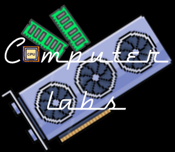

# Computer Labs 

    

This is a Flask based web-application that features a store and pc building with compatible parts. We have guest users, customers who log in and signup, an admin who has access to admin panel, and employee panel for the employee. You can place orders of items individually or after you make a build.

## Implemented features:

1. 4 types of users:
    - [x] Store owners (admin)
    - [X] Store employees
    - [X] Customers
    - [X] Guest users
2. Implemented system features:
    - [X] A visitor can freely browse the available items in the store without the need of logging in and can provide comments on all items. A visitor can apply to be a customer by signing up with personal information.
    - [X] A store employee will process the application: either approve or reject, a reject decision should have a memo for the store owner to check in case the rejected applicant protests.
    - [X] Personalized behavior for different users: different types of users should be shown different web page when logged in.
    - [X] All customers must deposit some money to their account, any purchase exceeding the available deposited money will be denied and one warning is issued to the customer as a reckless behavior.
    - [X] For customers who chose to build a computer totally by themselves (not using the suggested configuration by the store), the system should automatically check the compatibility of different components. After finishing the transaction, the customer is given the choice of allowing the store to use this new configuration as a new suggested computer configuration.
    - [X] Any customer receiving up to 3 warnings will be kicked out of the system (unable to login any more, directed to see store employees in person for account closing matters when trying to login)
    - [X] A customer with 3 compliments will receive a 10% discount on the next purchase.
    - [X] Any store employee receivingup to 3 warnings will receive a demotion, anyone with up to 2 demotions will be fired. An employee with 3 compliments will receive a promotion.
    - [X] Creative feature: Web-application made usiing Python Flask, and MySQL backend.

3. To be implemented:
    - After making a successful purchase, the customer can rate the (1 worst, 5 best) configuration. -For any configuration receiving more than 3 highest ratings and no worst ones, the employee or the contributed customer who set it up will receive a “compliment”; 
    - for more than 3 lowest rations and no highest ones, the related party received a “warning”. 
    - The customer can communicate with store employees about any concerns over the purchase, and afterward, the customer can complain or compliment the employee to the store owner with justifications. The store employee can complain, or compliment the customer as well, the store owner will process the compliment/complaint by issuing a possibly different number of “compliments” or “warning” to the employee or customer, e.g., a very bad behavior may receive 3 warnings to severely punish the party.
    - Any computer configuration receiving the worst ratings will be removed and the one who set it up (employee or customer) received one warning. Conversely, anyone receiving the best ratings will be put on the top page of the store and the one who set it up received a compliment.
    - Any comments or communications of the system among visitors, customers, and employees should go thru a language checking. Visitor's comments with these words will be deleted immediately and not be shown at all, whereas others will receive a warning. if more than 3 taboo words present in one message, 2 warnings will be issued and the message is not shown.

## Screenshots:

